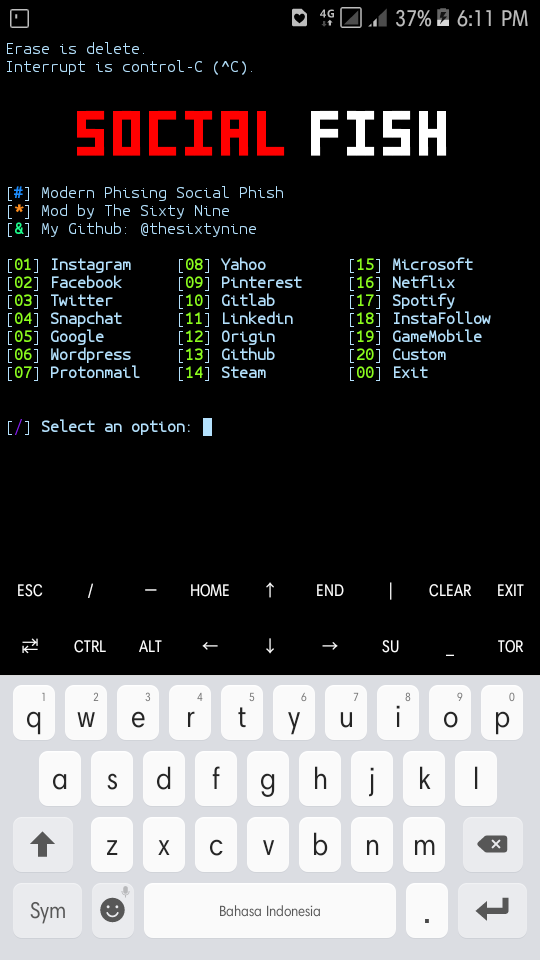

<p align="center">
  
</a></p>
<h1 align="center">Socialfish</h1>
<head bgcolor=black text=white>
		<title>This project adheres to No Code of Conduct. We are all adults. We accept anyone's contributions. Nothing else matters.</title>
	</head>

# Usage:
```
pkg update && pkg upgrade
apt-get install git
apt-get install bash
git clone https://github.com/thesixtynine/Socialfish
cd Socialfish
ls
bash socialfish.sh
```



# Paypal:
https://www.paypal.com/cgi-bin/webscr?cmd=_s-xclick&hosted_button_id=CLKRT5QXXFJY4&source=url
# LiberaPay:
<noscript><a href="https://liberapay.com/thesixtynine/donate"></a></noscript>
